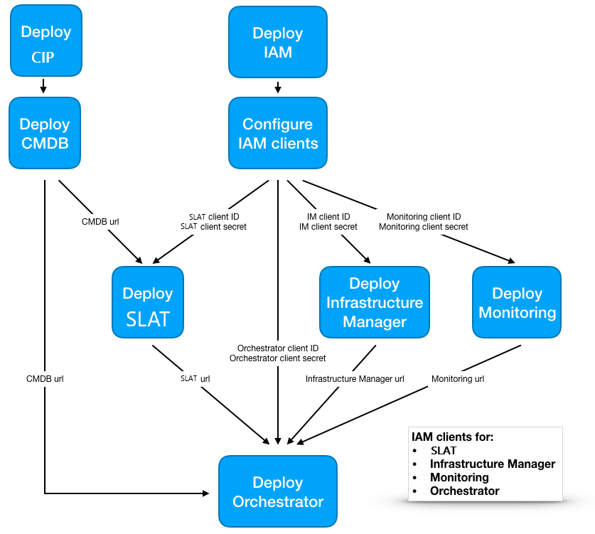

# Requirements

The roles, in this first version, have been written for Ubuntu 16.04.


# Deployment scenario:



# Configure the control machine

- install ansible <br>Recommended installation path: https://docs.ansible.com/ansible/latest/installation_guide/intro_installation.html#latest-releases-via-apt-ubuntu

- install jmespath needed by jquery
  ````
  sudo apt install python-jmespath
  ````

- Distribute the ssh key to all the nodes

- Clone the repository
  ````
  git clone https://github.com/indigo-dc/indigopaas-deploy.git
  cd indigopaas-deploy/ansible
  ````

- Edit the file inventory/inventory replacing the IPs

  ````
  [proxy]
  172.30.24.3

  [cmdb]
  172.30.24.4

  [slam]
  90.147.75.144

  [cpr]
  172.30.24.4

  [im]
  172.30.24.5

  [monitoring_server]
  172.30.24.6

  [monitoring_agent]
  172.30.24.7

  [orchestrator]
  172.30.24.8

  [monitoring:children]
  monitoring_server
  monitoring_agent

  ````

- Edit the variables in inventory/group_vars

- Run the playbooks for each service you want to deploy. 
  The recommended order is the following:
  ````
  ansible-playbook -i inventory/inventory playbooks/deploy-proxy.yml
  ansible-playbook -i inventory/inventory playbooks/deploy-iam.yml
  ansible-playbook -i inventory/inventory playbooks/deploy-cmdb.yml
  ansible-playbook -i inventory/inventory playbooks/deploy-slam.yml
  ansible-playbook -i inventory/inventory playbooks/deploy-cpr.yml
  ansible-playbook -i inventory/inventory playbooks/deploy-im.yml
  ansible-playbook -i inventory/inventory playbooks/deploy-monitoring.yml
  ansible-playbook -i inventory/inventory playbooks/deploy-orchestrator.yml
  ansible-playbook -i inventory/inventory playbooks/deploy-orchestrator-dashboard.yml
  ````
  
## Troubleshooting

If running a playbook you get the following error:

```
fatal: [172.30.24.4]: FAILED! => {"msg": "Timeout (12s) waiting for privilege escalation prompt: "}
```

increase the timeout value in the file ansible.cfg and then re-run the playbook


  
